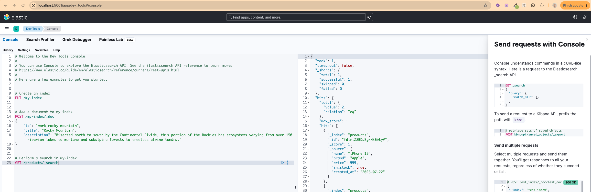

# Elastic Search

Elasticsearch is a highly scalable, open-source search and analytics engine built on Apache Lucene. It stores data in flexible JSON format and uses "inverted indices" to deliver near-instant full-text search, data aggregation, and vector search capabilities across massive datasets

<a href="https://www.elastic.co/elasticsearch" target="_blank" rel="noopener noreferrer">Official documentation</a>

### Table of Content

[Create Index with a mapping](#create-index-with-a-mapping)

[Insert Sample Documents](#insert-sample-documents)

[Running Search Query](#running-search-query)

- [Fuzzy Search](#fuzzy-search)

[Running Aggregation Query](#aggregation-query)

[Running query in Kibana](#running-query-in-kibana)

## Create Index with a mapping

Here **products** is the index

```bash
curl -X PUT http://localhost:9200/products \
  -H "Content-Type: application/json" \
  -d '{
    "mappings": {
      "properties": {
        "name": { "type": "text" },
        "brand": { "type": "keyword" },
        "price": { "type": "float" },
        "in_stock": { "type": "boolean" },
        "created_at": { "type": "date" }
      }
    }
  }'
```

## Insert Sample Documents

Document 1

```bash
curl -X POST http://localhost:9200/products/_doc \
  -H "Content-Type: application/json" \
  -d '{"name":"iPhone 15","brand":"Apple","price":999,"in_stock":true,"created_at":"2026-07-22"}'
```

Document 2

```bash
curl -X POST http://localhost:9200/products/_doc \
  -H "Content-Type: application/json" \
  -d '{"name":"Galaxy S24","brand":"Samsung","price":899,"in_stock":true,"created_at":"2026-07-20"}'
```

## Running Search Query

```bash
curl -X GET http://localhost:9200/products/_search?pretty \
  -H "Content-Type: application/json" \
  -d '{"query":{"match":{"name":"iphone"}}}'
```

When using curl, if this doesn't work, remove **pretty** at end

We can also use **Postman** to run this query

In **Body**, add query in **Body**

```json
{
	"query": {
		"term": {
			"brand": "Apple"
		}
	}
}
```

Here, we are searching for documents with brand equal to Apple

### Result of Search

```json
{
	"took": 2,
	"timed_out": false,
	"_shards": {
		"total": 1,
		"successful": 1,
		"skipped": 0,
		"failed": 0
	},
	"hits": {
		"total": {
			"value": 1,
			"relation": "eq"
		},
		"max_score": 0.6931471,
		"hits": [
			{
				"_index": "products",
				"_id": "fdiriZ8BDd5gxN36btyV",
				"_score": 0.6931471,
				"_source": {
					"name": "iPhone 15",
					"brand": "Apple",
					"price": 999,
					"in_stock": true,
					"created_at": "2026-07-22"
				}
			}
		]
	}
}
```

### Fuzzy Search

For typo-tolerance search, use match with **fuzziness**

```json
{
	"query": {
		"match": {
			"title": {
				"query": "Privte",
				"fuzziness": "AUTO"
			}
		}
	}
}
```

For more advance search, where we have to search for phrase and not only a single word, we can use **match_phrase**

```json
{
	"query": {
		"match_phrase": {
			"title": {
				"query": "Privte",
				"fuzziness": "AUTO"
			}
		}
	}
}
```

Note: We can also search for **Synonyms** using **analysis** instead of match.

## Aggregation Query

Send this as query body in search endpoint

```json
{
	"size": 0,
	"aggs": {
		"avg_price": {
			"avg": {
				"field": "price"
			}
		},
		"by_brand": {
			"terms": {
				"field": "brand"
			}
		}
	}
}
```

### Result of aggregation query

```json
{
	"took": 31,
	"timed_out": false,
	"_shards": {
		"total": 1,
		"successful": 1,
		"skipped": 0,
		"failed": 0
	},
	"hits": {
		"total": {
			"value": 2,
			"relation": "eq"
		},
		"max_score": null,
		"hits": []
	},
	"aggregations": {
		"avg_price": {
			"value": 949.0
		},
		"by_brand": {
			"doc_count_error_upper_bound": 0,
			"sum_other_doc_count": 0,
			"buckets": [
				{
					"key": "Apple",
					"doc_count": 1
				},
				{
					"key": "Samsung",
					"doc_count": 1
				}
			]
		}
	}
}
```

## Deleting documents in index

This request in dev tools in Kibana can delete all documents in index products

```
POST /products/_delete_by_query
{
  "query": {
    "match_all": {}
  }
}
```

## Running query in Kibana

Open side menu on left, go to Management > Dev Tools

Here you can write requests

Can also send request body as shown in the image below along with the request url


