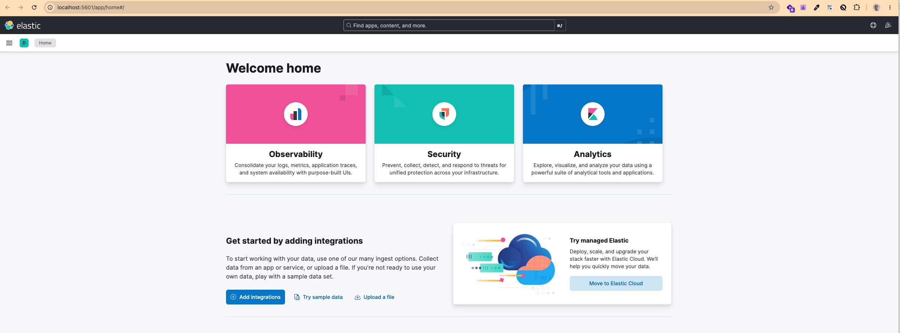

# Setup

The platform is setup in docker.

So use docker compose command to run it.

```bash
docker compose up --build
```

You can view the web interface with **Kibana** using following link

[View Kibana](http://localhost:5601/app/home#/)

Kibana looks like this


